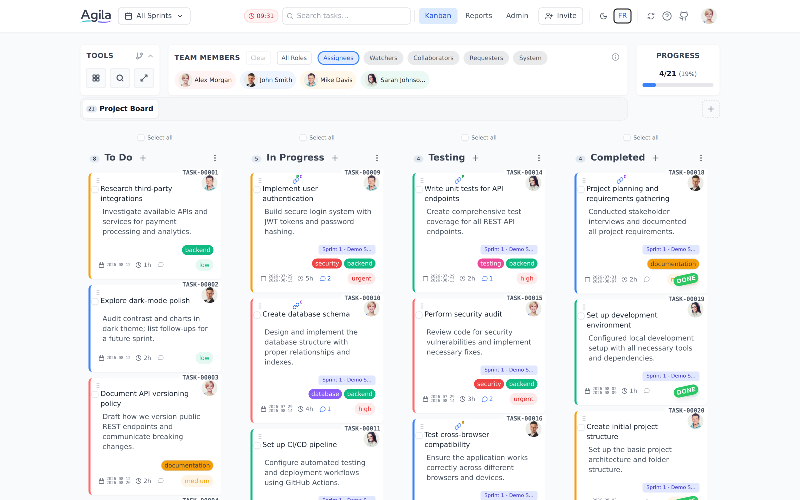
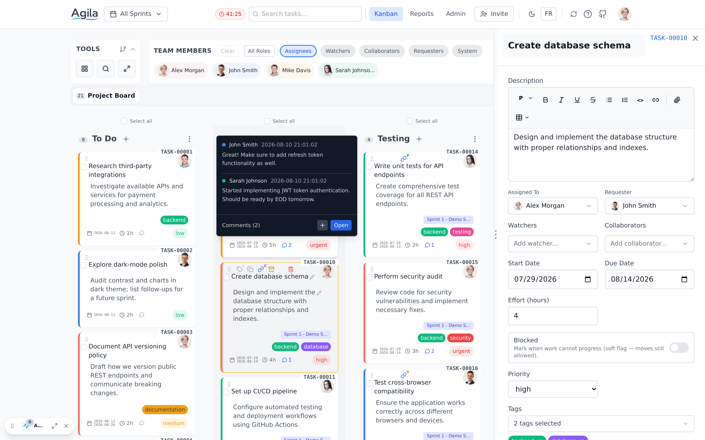
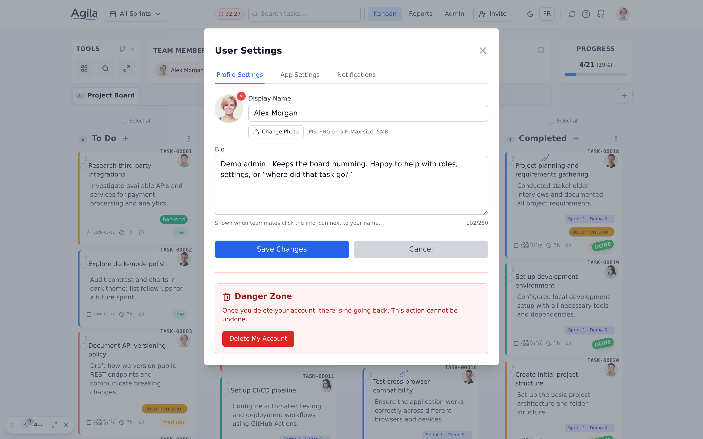
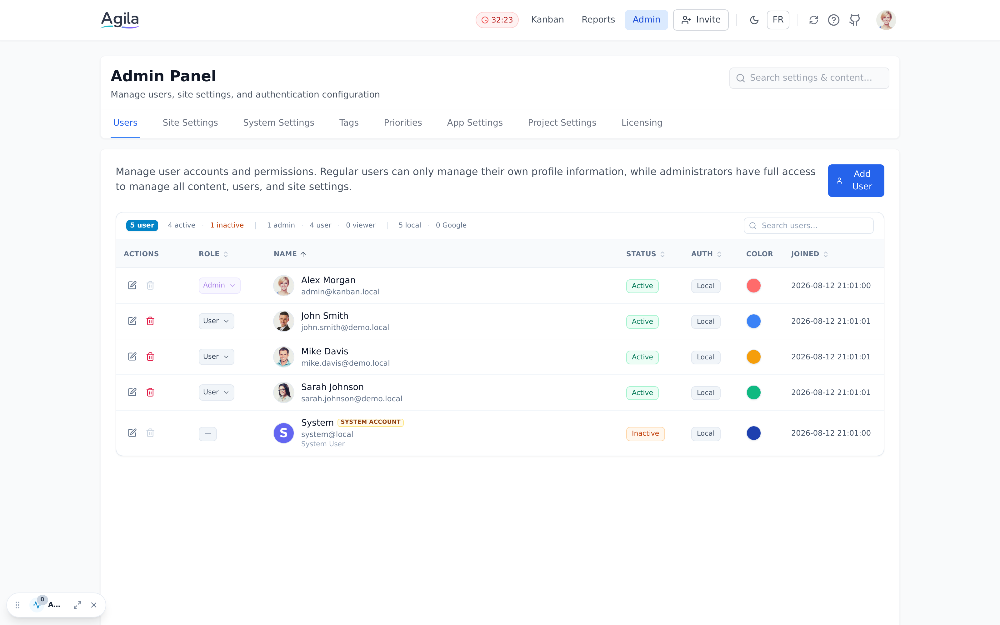
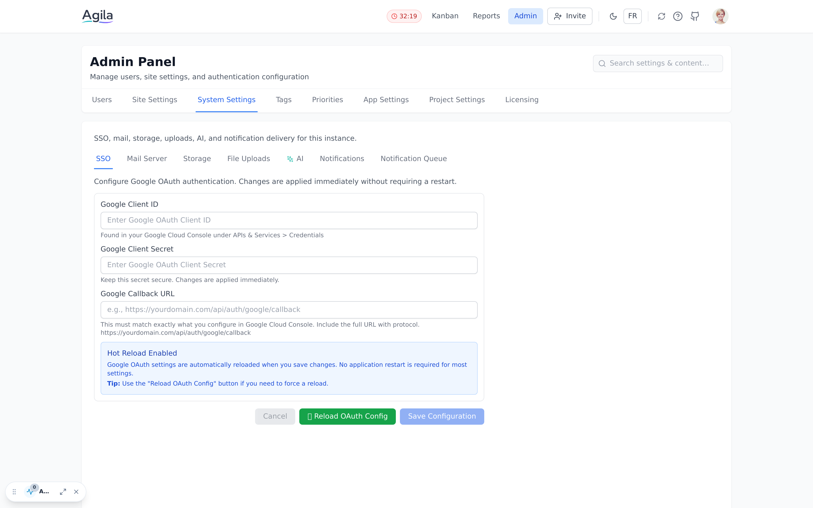
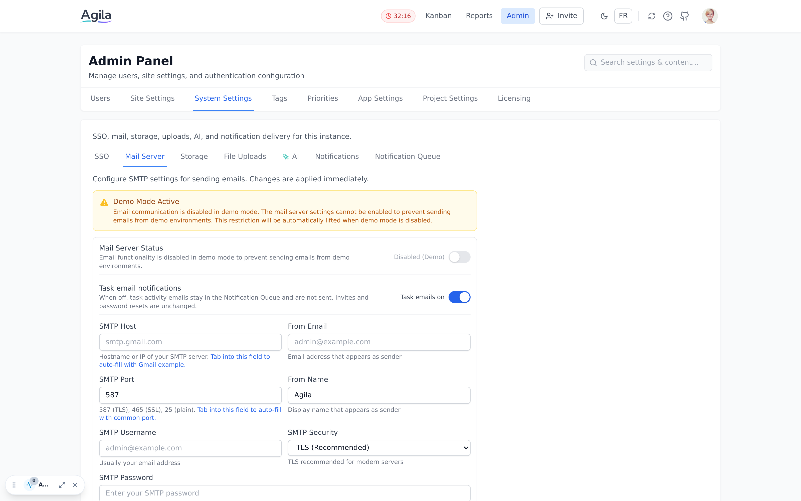

# Agila Screenshots

This document showcases a sample set of screenshots from the Agila interface.

---

## Overview — Main Kanban Board

The main board with columns, task cards, team filters, and board progress.

*Multi-column board, task cards (IDs, assignees, priorities, tags, effort and dates), team member and role filters, board progress, sprint selector, and navigation to Reports and Admin*

---

## Task Details & Comments

Selected task with the details side panel open, plus a comment preview on another card.

*Task details panel (assignee, requester, watchers, collaborators, dates, effort, blocked state, priority, tags), comment tooltip on a card, and the board behind the panel*

---

## User Profile Management

User settings modal for profile and related preferences.

*Profile Settings (avatar, display name), App Settings and Notifications tabs, and account deletion options*

---

## Admin Panel — User Management

Admin Users tab for accounts, roles, and status.

*User table with status, role, auth type, and color; add and edit actions; admin navigation across site, auth, mail, and project settings*

---

## Admin Panel — SSO Configuration

Google OAuth / SSO settings.

*Google Client ID, Client Secret, and callback URL; SSO debug logging; save and reload OAuth controls*

---

## Admin Panel — Mail Server Settings

SMTP configuration for outbound mail (demo build shown with mail disabled).

*SMTP host, port, credentials, from address and name, TLS security, demo-mode sending restriction, and save / test email actions*
